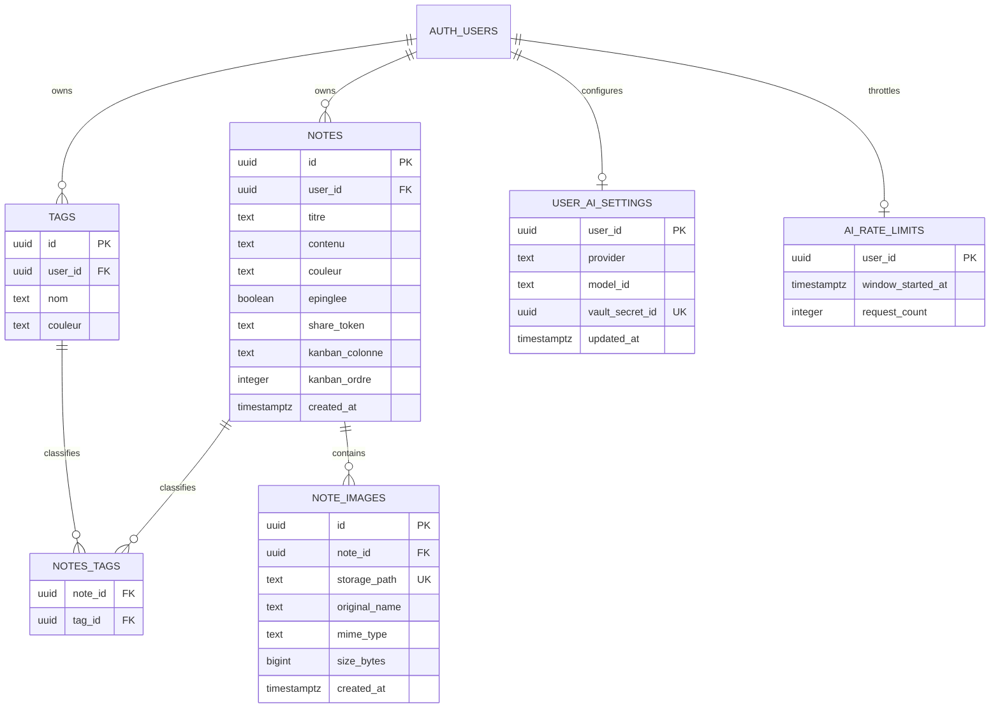
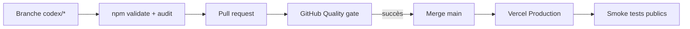

# Architecture technique — Capsule

## 1. Vue d'ensemble

Capsule est une application de notes Next.js déployée sur Vercel. Le navigateur
utilise Supabase pour l'authentification, les données et le Storage privé. Les
flux serveur sensibles gèrent le BYOK Anthropic et le partage public d'une note.

```mermaid
flowchart LR
    U[Utilisateur Safari ou navigateur] -->|HTTPS| N[Next.js sur Vercel]
    N --> C[Client React Capsule]
    C -->|Auth + Data API| S[(Supabase PostgreSQL)]
    C -->|Storage API| B[(Bucket privé note-images)]
    C -->|Bearer + clé session facultative| A[/api/ai + /api/resumer]
    A -->|Validation session + quota| S
    A -->|Clé synchronisée| X[(Supabase Vault)]
    A -->|Catalogue et résumé| H[Anthropic]
    V[Visiteur lien partagé] --> P[/share/token]
    P -->|Lecture anonyme RLS| S
    P -->|Clé serveur après validation| B
    SW[Service worker] -->|Shell statique uniquement| N
```

## 2. Contextes d'exécution

### Navigateur authentifié

`app/page.js` orchestre la session, le CRUD, les vues, les tags et les images.
Le singleton `lib/supabase.js` utilise uniquement une clé publique et laisse
PostgreSQL/Storage appliquer RLS.

### Serveur Next.js

- `app/api/ai/settings/route.js` expose seulement le statut et le modèle ; les
  écritures passent par des RPC serveur et Supabase Vault.
- `app/api/ai/models/route.js` charge le catalogue avec la clé de session ou la
  clé synchronisée, après authentification et quota.
- `app/api/resumer/route.js` borne la note, choisit la configuration explicite,
  consomme le quota atomique puis appelle Anthropic.
- `app/share/[token]/page.js` lit une note partageable avec le client public.
- `lib/supabase-admin.js` crée un client serveur secret uniquement pour signer
  les images déjà validées comme appartenant à la note partagée.

### Service worker

`public/sw.js` ne traite que le shell statique et `/offline`. Les réponses
Supabase, les notes, les images signées et `/api/resumer` sont hors cache.

## 3. Modules

| Module | Responsabilité | Frontière importante |
|---|---|---|
| `app/page.js` | Orchestration principale et UI historique | Client Component, monolithe à réduire progressivement |
| `app/login/page.js` | Connexion et inscription | Clé publique seulement |
| `components/AppHeader.js` | Hiérarchie, vues et actions prioritaires | Responsive sans perdre les noms accessibles |
| `components/MobileNavigation.js` | Navigation tactile persistante | Respecte les zones sûres iOS |
| `components/CommandPalette.js` | Recherche de commandes et notes | Aucune indexation ni persistance externe |
| `components/ui/Dialog.js` | Modale accessible réutilisable | Focus confiné, restitué et fermeture Échap |
| `components/ui/ToastViewport.js` | Feedback non bloquant et annulation | Quatre messages maximum, temporisation locale |
| `lib/modal-isolation.js` | Isolation des couches modales et ordre du focus | Fond inerte, toasts interactifs explicitement exemptés |
| `app/share/[token]/page.js` | Lecture publique et signature d'images | Server Component |
| `components/AISettingsDialog.js` | Modes session/Vault et choix du modèle | Aucun stockage navigateur persistant |
| `app/api/ai/settings/route.js` | Statut et cycle du BYOK | Ne renvoie jamais la clé |
| `app/api/ai/models/route.js` | Catalogue de modèles Anthropic | Auth, quota et erreurs normalisées |
| `app/api/resumer/route.js` | Résumé IA | Auth, limites et quota avant appel externe |
| `lib/ai-settings-server.js` | Accès aux réglages, Vault et quota | Client Supabase secret serveur uniquement |
| `lib/anthropic.js` | Requêtes fournisseur bornées | Aucun corps d'erreur amont relayé |
| `components/NoteContentEditor.js` | Texte, fichiers, collage, aperçus | Aucun upload avant sauvegarde |
| `components/MarkdownRenderer.js` | Markdown et résolution `capsule-image` | Ne stocke jamais d'URL signée |
| `components/ImageLightbox.js` | Visionneuse clavier, boutons et geste horizontal | Reçoit uniquement blob local ou URL signée |
| `components/StatsDrawer.js` | Agrégations et graphiques | Dépend de RLS sur trois tables |
| `lib/note-images.js` | Format stable et validations pures | Testable sans Supabase |
| `lib/image-compression.js` | Décodage, redimensionnement et WebP local | Source 20 Mio, sortie 5 Mio, garde mémoire 40 Mpx |
| `lib/markdown-editor.js` | Transformations de sélection Markdown | Fonctions pures testées |
| `lib/ui-capabilities.js` | Partage et transitions de vues | Dégradation progressive et mouvement réduit |
| `lib/note-image-storage.js` | Upload, copie, suppression, signature | Compensation sur erreur |
| `scripts/audit-note-images.mjs` | Audit read-only Markdown/SQL/Storage | Aucune méthode d'écriture ou suppression |
| `lib/supabase.js` | Client navigateur | Variables publiques uniquement |
| `lib/supabase-admin.js` | Client serveur secret | Import client interdit |
| `public/sw.js` | Installation PWA et repli réseau | Aucune donnée privée en cache |

## 4. Modèle de données



Le noyau historique est versionné par la baseline `20260826000000` et la
migration images `20260826120000`. AI-001 est ajouté par `20260827094500`.
Toute évolution suivante est forward-only.

## 5. Flux critiques

### Création ou édition avec images

1. La source est validée localement : JPEG/PNG/WebP, 1 octet à 20 Mio.
2. Elle est décodée séquentiellement, limitée à 2 048 px puis encodée en WebP
   si une optimisation est utile ou nécessaire.
3. Le fichier final est validé à 5 Mio maximum.
4. Un UUID et une référence `capsule-image/<uuid>` sont ajoutés au Markdown.
5. L'aperçu reste un `blob:` local jusqu'à Sauver/Créer.
6. La note existe avant l'upload afin de satisfaire la policy Storage.
7. Le fichier est envoyé vers `<user>/<note>/<image>.<ext>` avec progression par
   fichier, puis la métadonnée est insérée dans `note_images`.
8. En cas d'échec, les objets déjà envoyés sont supprimés en compensation.

### Duplication

Chaque objet Storage reçoit un nouveau chemin et chaque référence Markdown un
nouvel UUID. Une duplication ne partage donc pas le cycle de vie des fichiers
avec la note d'origine.

### Suppression

Les objets sont supprimés par l'API Storage avant la ligne `notes`. La cascade
supprime ensuite les métadonnées. Un échec de nettoyage doit rester visible et
être surveillé pour éviter les objets orphelins.

### Partage public

1. Le token opaque doit retrouver une note partageable via RLS anonyme.
2. Seuls les UUID présents dans le Markdown sont considérés.
3. Les métadonnées doivent appartenir au `note_id` trouvé.
4. Le chemin doit commencer par `<owner>/<note>/`.
5. Le serveur signe pour dix minutes ; l'URL n'est jamais persistée.

### Résumé Anthropic

1. Le client transmet le token Supabase et, en mode session seulement, la clé
   éphémère avec le modèle sélectionné.
2. Le serveur valide d'abord l'utilisateur, les longueurs et les formats.
3. En mode synchronisé, une RPC `SECURITY DEFINER` lit la clé déchiffrée dans
   Vault sans l'inclure dans une réponse.
4. `consume_ai_quota` verrouille la ligne utilisateur et applique 10 sorties
   externes par fenêtre de 60 secondes.
5. Le serveur appelle `/v1/models` ou `/v1/messages` avec `no-store`, un délai
   borné et des erreurs normalisées.
6. La suppression du réglage ou du compte déclenche la purge du secret Vault.

La clé Vercel historique n'est jamais utilisée implicitement. Voir
`docs/AI_BYOK.md` pour le contrat détaillé et la recette.

### Interaction moderne progressive

- le changement cartes/liste/Kanban utilise View Transition si le navigateur le
  permet, sinon la mise à jour React reste immédiate ;
- le partage préfère la feuille système, avec copie du lien en repli ;
- le Kanban utilise Pointer Events au tactile et conserve un sélecteur explicite
  de colonne comme solution clavier/accessibilité ;
- la palette et les dialogues n'enregistrent ni requête ni contenu de note ;
- `prefers-reduced-motion` neutralise les animations non essentielles.

## 6. Déploiement



Le ruleset `main-quality-gate` exige une PR, une branche à jour et le contrôle
`Quality gate`, sans bypass. Vercel déploie automatiquement le `main` fusionné.

## 7. Propriétés de sécurité à préserver

- RLS activée sur toutes les tables exposées par la Data API.
- Propriété vérifiée côté note et tag pour `notes_tags`.
- Bucket privé et préfixe Storage lié à `auth.uid()`.
- Grants minimaux indépendamment des policies RLS.
- Clé serveur absente du bundle client.
- Clé Anthropic absente des stockages persistants navigateur, réponses et logs.
- Tables IA sous RLS forcée, sans grant navigateur ; RPC de secret réservées au
  `service_role` et quota atomique avant chaque sortie fournisseur.
- Aucune donnée privée dans le cache PWA ou les journaux.
- Migrations forward-only et rollback applicatif non destructif.

## 8. Dette structurante

- `app/page.js` concentre environ 3 000 lignes et de nombreux états.
- Aucun E2E n'exécute encore un parcours contre une vraie session Supabase.
- Le nettoyage d'images orphelines n'est pas automatisé.
- Le quota IA est volontairement une fenêtre fixe en base ; les métriques
  agrégées et alertes fournisseur restent à traiter dans `OPS-002`.
- Le noyau Supabase historique est baseliné ; le `db reset` conteneurisé reste
  suivi par `TOOL-002`.
