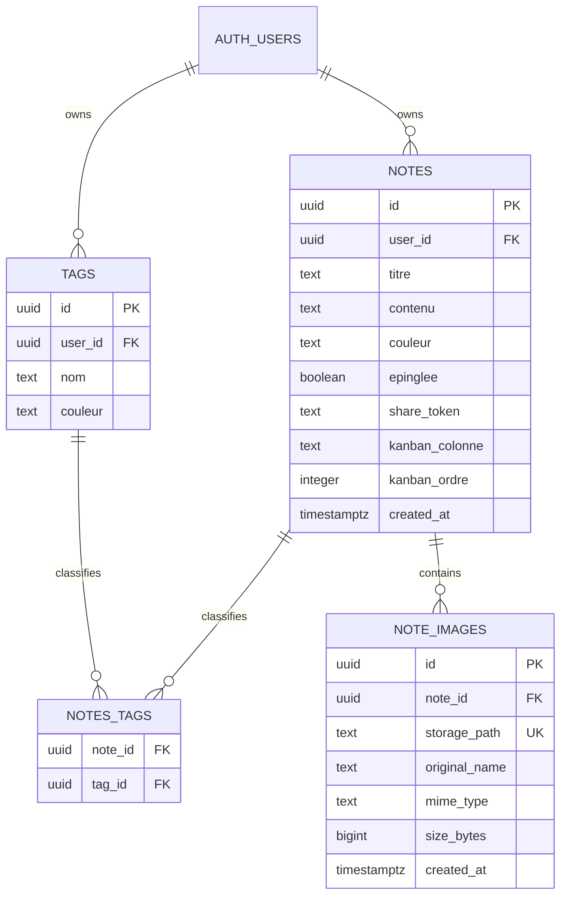
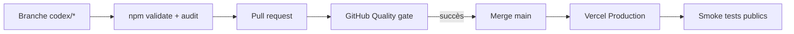

# Architecture technique — Capsule

## 1. Vue d'ensemble

Capsule est une application de notes Next.js déployée sur Vercel. Le navigateur
utilise Supabase pour l'authentification, les données et le Storage privé. Deux
flux serveur existent : le résumé Anthropic et le partage public d'une note.

```mermaid
flowchart LR
    U[Utilisateur Safari ou navigateur] -->|HTTPS| N[Next.js sur Vercel]
    N --> C[Client React Capsule]
    C -->|Auth + Data API| S[(Supabase PostgreSQL)]
    C -->|Storage API| B[(Bucket privé note-images)]
    C -->|Bearer token| A[/api/resumer]
    A -->|Validation session| S
    A -->|API serveur| H[Anthropic]
    V[Visiteur lien partagé] --> P[/share/token]
    P -->|Lecture anonyme RLS| S
    P -->|Clé serveur après validation| B
    SW[Service worker] -->|Shell statique uniquement| N
```

## 2. Contextes d'exécution

### Navigateur authentifié

`app/page.js` orchestre la session, le CRUD, les vues, les tags et les images.
Le singleton `lib/supabase.js` utilise uniquement une clé publique et laisse
PostgreSQL/Storage appliquer RLS.

### Serveur Next.js

- `app/api/resumer/route.js` authentifie le Bearer token, puis appelle Anthropic.
- `app/share/[token]/page.js` lit une note partageable avec le client public.
- `lib/supabase-admin.js` crée un client serveur secret uniquement pour signer
  les images déjà validées comme appartenant à la note partagée.

### Service worker

`public/sw.js` ne traite que le shell statique et `/offline`. Les réponses
Supabase, les notes, les images signées et `/api/resumer` sont hors cache.

## 3. Modules

| Module | Responsabilité | Frontière importante |
|---|---|---|
| `app/page.js` | Orchestration principale et UI historique | Client Component, monolithe à réduire progressivement |
| `app/login/page.js` | Connexion et inscription | Clé publique seulement |
| `app/share/[token]/page.js` | Lecture publique et signature d'images | Server Component |
| `app/api/resumer/route.js` | Résumé IA | Auth avant appel externe |
| `components/NoteContentEditor.js` | Texte, fichiers, collage, aperçus | Aucun upload avant sauvegarde |
| `components/MarkdownRenderer.js` | Markdown et résolution `capsule-image` | Ne stocke jamais d'URL signée |
| `components/StatsDrawer.js` | Agrégations et graphiques | Dépend de RLS sur trois tables |
| `lib/note-images.js` | Format stable et validations pures | Testable sans Supabase |
| `lib/note-image-storage.js` | Upload, copie, suppression, signature | Compensation sur erreur |
| `lib/supabase.js` | Client navigateur | Variables publiques uniquement |
| `lib/supabase-admin.js` | Client serveur secret | Import client interdit |
| `public/sw.js` | Installation PWA et repli réseau | Aucune donnée privée en cache |

## 4. Modèle de données



Les migrations historiques du noyau sont en cours de baselining sous `DB-001`.
Jusqu'à sa clôture, le schéma effectif de production doit être vérifié avant
toute évolution.

## 5. Flux critiques

### Création ou édition avec images

1. Le fichier est validé localement : JPEG/PNG/WebP, 1 octet à 5 Mio.
2. Un UUID et une référence `capsule-image/<uuid>` sont ajoutés au Markdown.
3. L'aperçu reste un `blob:` local jusqu'à Sauver/Créer.
4. La note existe avant l'upload afin de satisfaire la policy Storage.
5. Le fichier est envoyé vers `<user>/<note>/<image>.<ext>`.
6. La métadonnée est insérée dans `note_images`.
7. En cas d'échec, les objets déjà envoyés sont supprimés en compensation.

### Duplication

Chaque objet Storage reçoit un nouveau chemin et chaque référence Markdown un
nouvel UUID. Une duplication ne partage donc pas le cycle de vie des fichiers
avec la note d'origine.

### Suppression

Les objets sont supprimés par l'API Storage avant la ligne `notes`. La cascade
supprime ensuite les métadonnées. Un échec de nettoyage doit rester visible et
être surveillé pour éviter les objets orphelins.

### Partage public

1. Le token opaque doit retrouver une note partageable via RLS anonyme.
2. Seuls les UUID présents dans le Markdown sont considérés.
3. Les métadonnées doivent appartenir au `note_id` trouvé.
4. Le chemin doit commencer par `<owner>/<note>/`.
5. Le serveur signe pour dix minutes ; l'URL n'est jamais persistée.

### Résumé Anthropic

Le client transmet le token de session. La route valide l'utilisateur avant de
vérifier la configuration Anthropic et d'appeler l'API. Un rate-limit
persistant reste à ajouter.

## 6. Déploiement



Le ruleset `main-quality-gate` exige une PR, une branche à jour et le contrôle
`Quality gate`, sans bypass. Vercel déploie automatiquement le `main` fusionné.

## 7. Propriétés de sécurité à préserver

- RLS activée sur toutes les tables exposées par la Data API.
- Propriété vérifiée côté note et tag pour `notes_tags`.
- Bucket privé et préfixe Storage lié à `auth.uid()`.
- Grants minimaux indépendamment des policies RLS.
- Clé serveur absente du bundle client.
- Aucune donnée privée dans le cache PWA ou les journaux.
- Migrations forward-only et rollback applicatif non destructif.

## 8. Dette structurante

- `app/page.js` concentre environ 3 000 lignes et de nombreux états.
- Aucun E2E n'exécute encore un parcours contre une vraie session Supabase.
- Le nettoyage d'images orphelines n'est pas automatisé.
- `/api/resumer` n'a pas de quota persistant.
- Le noyau Supabase historique est baseliné ; le `db reset` conteneurisé reste
  suivi par `TOOL-002`.
